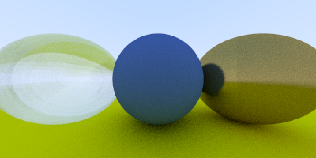
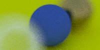
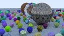

# PixelWeave

A simple Path Tracing Rendering Engine written in Python

It is currently painstakingly slow as it is a bare minimum renderer with no optimizations done at all.

This is a project in development and the final result as planned is a real time ray tracing engine with ML-based super sampling and possibly, video rendering with ability to skip frames and using ML-technicues to fill in.

## Renders

It is currently capable of producing the following basic renders and similar ones.

### 1) A basic three sphere configuration with no camera effects

    

### 2) The same three sphere configuration with changeable camera position and Depth Of Field Effects

    

### 3) A randomly generated scene filled with 100 spheres with different material properties

    

Clearly the above images are of not high quality. The reasons for them and future upgrades planned to combat it.

1. Extremely large render times - add scene graph optimizations (BVH to start with)
2. Lower samples lead to noisy renders - add denoising capability
3. Parallelize Code - the problem is after all "Embarassingly Parallel"
4. Only has hemispheric light support - Add other PBR lights
5. Add texturing support
6. Add animation primitives (also motion blur)
7. Support for triangles and other shape primitives
